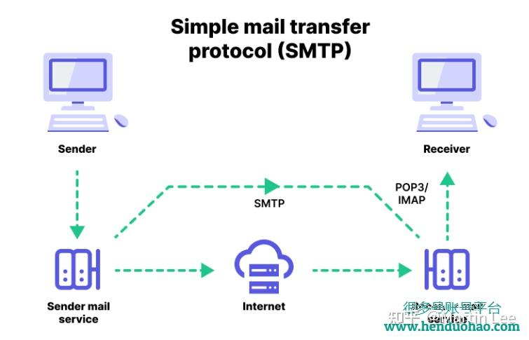
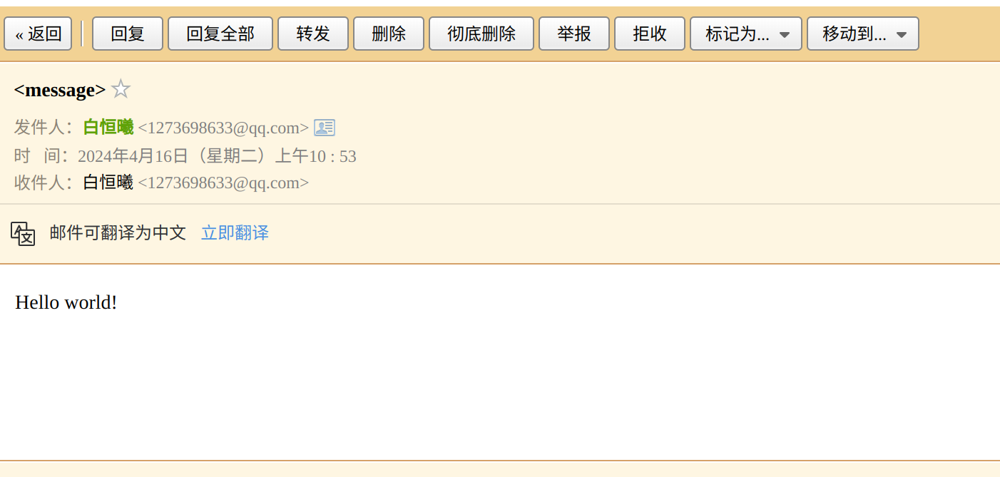

# Lab 0 network warmup

0. Collaboration Policy：

   - 不能借鉴网络与他人的代码，自己独立完成才能提高（除非你只是为了简历好看）

1. Set up GNU/Linux on your computer

   - 一些实验要求

     - 一个支持C++20的编译器

     - 在Ubuntu23.10上进行实验，可以用双系统、虚拟机、云虚拟机（我用的Ubuntu22.04进行代替，可能会遇到一些BUG

     - 运行以下代码，引入一些依赖项

       ```shell
       sudo apt update && sudo apt install git cmake gdb build-essential clang \
       clang-tidy clang-format gcc-doc pkg-config glibc-doc tcpdump tshark
       ```

     - wireshark会问你是否允许非特权用户进行抓包，我们选yes即可

2. Networking by hand

   - 两个小任务（用telnet）

     - 从网络上获取一个网页
     - 发送一个email

   - 下面的实验使用了telnet，telnet是一个远程登录协议，现在可以拿来当做发网络请求的工具。用的不多，就不细说了

   - Fetch a Web Page（实现代码如下）

     输入

     ```shell
     telnet cs144.keithw.org http
     ```

     输出

     ```shell
     Trying 104.196.238.229...
     Connected to cs144.keithw.org.
     Escape character is '^]'.
     ```

     输入（注意这里有两个回车请求才能发出去）

     ```sh
     GET /hello HTTP/1.1
     Host: cs144.keithw.org
     Connection: close
     
     ```

     输出

     ```sh
     HTTP/1.1 200 OK
     Date: Tue, 16 Apr 2024 01:38:28 GMT
     Server: Apache
     Last-Modified: Thu, 13 Dec 2018 15:45:29 GMT
     ETag: "e-57ce93446cb64"
     Accept-Ranges: bytes
     Content-Length: 14
     Connection: close
     Content-Type: text/plain
     
     Hello, CS144!
     Connection closed by foreign host.
     ```

   - Send yourself an email

     - 这里原技术文档使用的是Stanford的邮箱，那我必然没有呀，用QQ邮箱代替

     - 邮件作为早期的网络工具，有它自己的协议。

       - 发送邮件使用的是SMTP（Simple Mail Transfer Protocol）协议
       - 接受邮件使用的是POP3或者IMAP协议
       - 基本原理如下图所示
       - 

       - 下面是实验流程

         ```shell
         telnet smtp.qq.com smtp
         Trying 120.232.69.34...
         Connected to smtp.qq.com.
         Escape character is '^]'.
         220 newxmesmtplogicsvrsza15-1.qq.com XMail Esmtp QQ Mail Server.
         helo qq.com
         250-newxmesmtplogicsvrsza15-1.qq.com-30.163.159.208-59933089
         250-SIZE 73400320
         250 OK
         auth login
         334 VXNlcm5hbWU6
         MTI3MzY5ODYzM0BxcS5jb20=
         334 UGFzc3dvcmQ6
         dXNreWxhbW56anR0Z2liYg==
         235 Authentication successful
         mail from:<1273698633@qq.com>
         250 OK
         rcpt to:<1273698633@qq.com>
         250 OK
         data
         354 End data with <CR><LF>.<CR><LF>.
         From:<1273698633@qq.com>
         To:<1273698633@qq.com>
         Subject:<message>
         
         Hello world!
         ```

         总而言之就是麻烦，使用企业邮箱的话要有授权码（安全起见），可能还要用base64加密

         最后结果如下

         

   - Listening and connecting

     - 命令行本地部署一个简单服务器

       ```shell
       netcat -v -l -p 9090
       ```

     - 通过telnet远程建立连接

       ```shell
       telnet localhost 9090
       ```

     - 建立连接后，双方可以直接通信，在telnet中的输入会输出在netcat上（我暂时没有了解其中的原理）

3. Writing a network program using an OS stream socket

   - 一个套接字编程的demo
   
   - 克隆这个项目
   
     ```
     git clone https://github.com/cs144/minnow
     ```
   
   - 这里发现了两个问题（ubuntu版本问题）
   
     - CMAKE版本要求3.24.x我降到了3.22.x
     - Gcc要求支持C++20，需要换Gcc13
   
   - 之后就能按照教程跑起来了
   
   - Modern C++: mostly safe but still fast and low-level
   
     - 这里给出了一些在本项目中C++的使用规范，同时也适用于大多数项目（为了安全）
       1. 不要用malloc,free,new,delete这种成对操作
       2. 不要用C风格字符串
       3. 本项目不涉及多线程、锁、虚函数
       4. 不要用指针和智能指针，用引用代替
       5. 尽量加const修饰
       6. 避免全局变量
   
   - Reading the Minnow support code
   
     - 阅读源码，主要是***util/socket.hh***和***util/file_descriptor.hh***这里基于面向对象设计原则对socket系统调用进行了封装
     - 